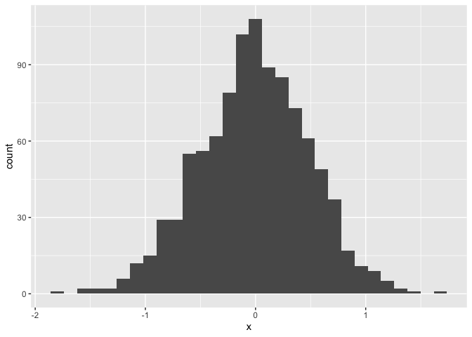
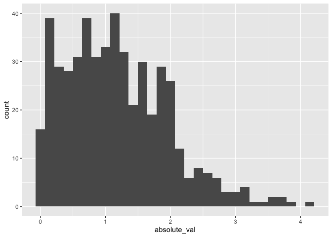

Simple document
================
Jessie Li
09-12-2023

I’m an R Markdown document!

# Section 1: First code chunk

Import library tidy verse:

``` r
library(tidyverse)
```

    ## ── Attaching core tidyverse packages ──────────────────────── tidyverse 2.0.0 ──
    ## ✔ dplyr     1.1.3     ✔ readr     2.1.4
    ## ✔ forcats   1.0.0     ✔ stringr   1.5.0
    ## ✔ ggplot2   3.4.3     ✔ tibble    3.2.1
    ## ✔ lubridate 1.9.2     ✔ tidyr     1.3.0
    ## ✔ purrr     1.0.2     
    ## ── Conflicts ────────────────────────────────────────── tidyverse_conflicts() ──
    ## ✖ dplyr::filter() masks stats::filter()
    ## ✖ dplyr::lag()    masks stats::lag()
    ## ℹ Use the conflicted package (<http://conflicted.r-lib.org/>) to force all conflicts to become errors

# Section 2: Make a plot

Here’s a **code chunk** that samples from a *normal distribution*:

``` r
samp = rnorm(100)
length(samp)
```

    ## [1] 100

I can take the mean of the sample, too! The mean is -0.2059.

# Section 3: Learning assessment!

This code is aborrowed from last lecture; it creates a dataframe for
plotting

``` r
plot_df = 
  tibble(
    x = rnorm(1000, sd = 0.5),
    y = 1 + 2 * x + rnorm(1000)
  )
```

And this code creates a histogram of plot_df:

``` r
ggplot(plot_df, aes(x = x)) + geom_histogram()
```

    ## `stat_bin()` using `bins = 30`. Pick better value with `binwidth`.

<!-- -->

This code chunk should creates a dataframe comprised of: a numeric
variable containing a random sample of size 500 from a normal variable
with mean 1; a logical vector indicating whether each sampled value is
greater than zero; and a numeric vector containing the absolute value of
each element.

Solution

``` r
tibble_table = 
  tibble(
    numeric_samp = rnorm(500, mean=1),
    logical_vec = numeric_samp > 0,
    absolute_val = abs(numeric_samp)
  )

ggplot(tibble_table, aes(x = absolute_val)) + geom_histogram()
```

    ## `stat_bin()` using `bins = 30`. Pick better value with `binwidth`.

<!-- -->

``` r
median_samp = median(pull(tibble_table, numeric_samp))
```

The median of the variable containing absolute values is 1.06.

# Section 4: Text formating examples

## Text formatting

*italic* or *italic* **bold** or **bold** `code` superscript<sup>2</sup>
and subscript<sub>2</sub>

## Headings

# 1st Level Header

## 2nd Level Header

### 3rd Level Header

## Lists

- Bulleted list item 1

- Item 2

  - Item 2a

  - Item 2b

1.  Numbered list item 1

2.  Item 2. The numbers are incremented automatically in the output.

## Tables

| First Header | Second Header |
|--------------|---------------|
| Content Cell | Content Cell  |
| Content Cell | Content Cell  |
